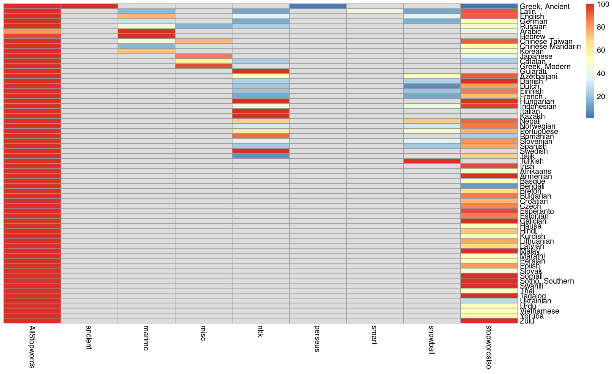

# morestopwords: All Stop Words in One Place 

Author: Fabio Ashtar Telarico, University of Ljubljana, FDV

<!-- badges: start -->

\
\
\
\


<!-- badges: end -->

# Introduction

`stopwords` is an R package originally developed by [Kohei Watanabe](https://github.com/koheiw) of the Waseda Institute for Advanced Study (check out his publications [here](https://scholar.google.com/citations?user=9BGfT7EAAAAJ&hl=en)) that provides easy access to stopwords in more than 50 languages in the Stopwords ISO library.

The package has not been updated since Dec 22, 2017 and was not installable anymore from `GitHub`. So, this reboot happened to grant continuity to the project.

# Installation

### CRAN (Stable release)

```         
install.packages('morestopwords')
```

### GitHub (Development version)

```         
if(requireNamespace('remotes'))
remotes::install_github('fatelarico/morestopwords')
```

# Usage

The code base has changed since version 0.1.0 (the last maintained by Dr. Watanabe). Now, the function `stopwords::stopwords()` supports not only two-letter ISO codes, but also three-letter ones. Moreover, it can identify languages by their ISO name (e.g., German, not *Deutsch*; Swedish, not *Sverige*, etc.).

# Comparison to similar packages

The package [`stopwords`](https://CRAN.R-project.org/package=stopwords) is also based on Watanabe's archived GitHub repository. Thus, it is the most similar to `morestopwords`, too. However, these two packages are differentiated by both design choices and features:

1.  `morestopwords` has got no dependencies and integrates with the package [`cld2`](https://CRAN.R-project.org/package=cld2).
2.  `morestopwords` can (if `cld2` is installed) identify the language of one (or more) string(s) automatically
3.  `morestopwords` can remove stop words from one or more strings either in conjuction with language detection or independently.
4.  `morestopwords` does not allow the user to choose a list of stop words to use. Rather, it tries to provide the most comprehensive list in an intuitive way.
5.  `morestopwords`'s lists include more stop words than any single list included in `stopwords`.


